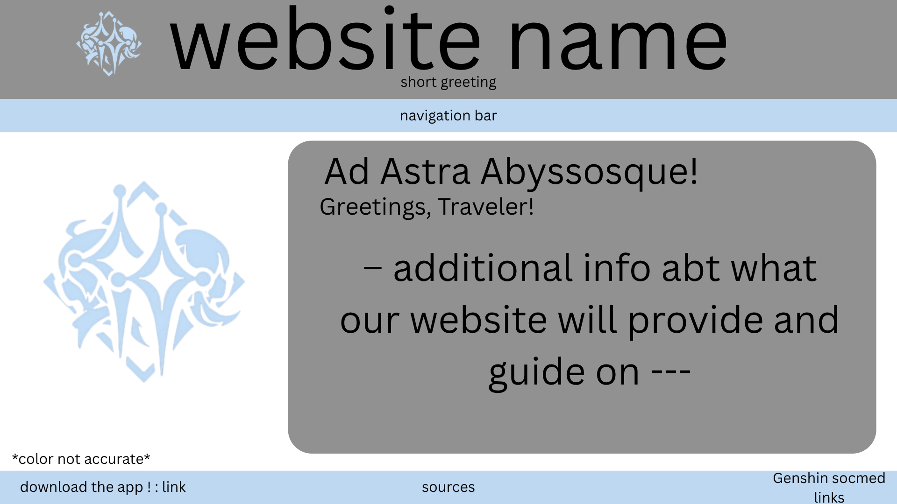
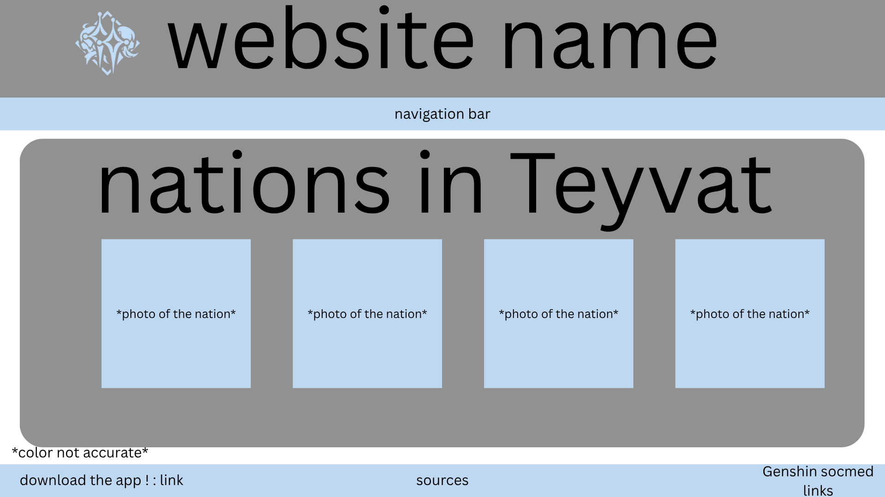
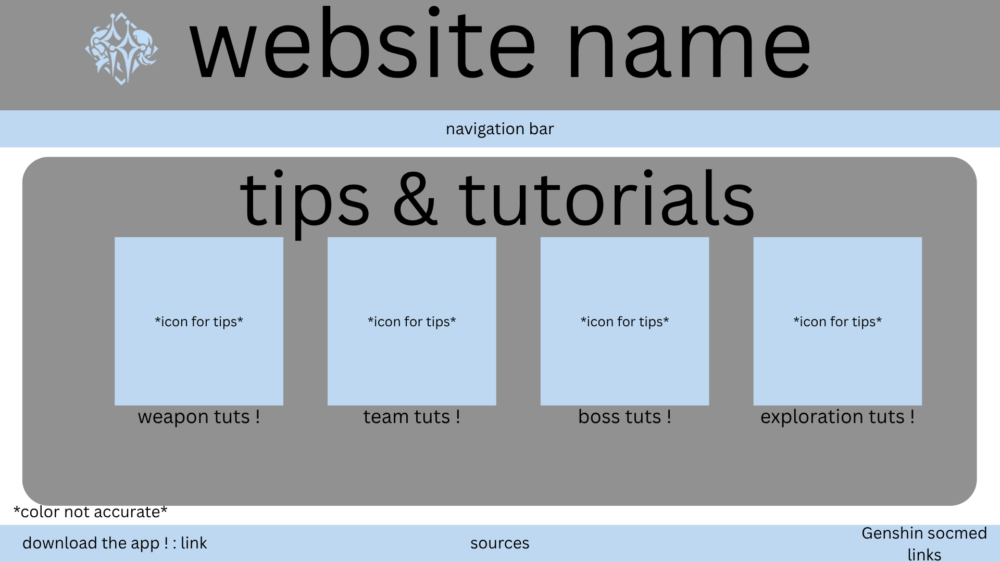
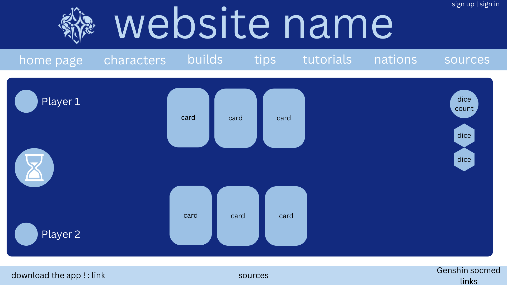

# WDProjCesiumPagulayanQuodala

#  Cs - Pagulayan, Quodala Project Proposal
## The Traveler’s Guide to Teyvat
Second title: Unraveling the Secrets of Teyvat, One Traveler at a Time 

Logo:

### Description
This website aims to help Genshin Impact players navigate their way to success in the game. This site will include character information, how to build said characters, tips, tutorials, and the nations of Teyvat. This can act as a helpful guide to starting (or improving) in Genshin if a player finds it hard to understand. 

### Webpage Breakdown:
1. **Home Page** - This will serve as the navigation. It will show a short description (along with a picture that encapsulates the information provided) of each webpage and their respective links when you click on the description.
2. **Characters** - This will be basically a showcase of all the current characters in Genshin Impact. Their pictures will be provided along with basic information such as birthday, occupation, and a description of their personality. Users can choose for them to show based on either nation, weapon, and element, but their default order is in order of release date separated by their nations. 
3. **Builds** - This will be guides on how to build and modify the characters shown in the character page. This webpage will incldue their best-in-slot artifacts, best weapons, and even team suggestions. This will include links to samples of team showcases and artifact tutorials for each character. 
4. **Tips** - This page will (probably) be divided into 3 sections: tips for combat, tips for exploration, and *personal* tips for the game (so more on experience)!
5. **Tutorials** - This page will have puzzles that players may have problems solving and how to solve them. This may also include common misconceptions/mistakes an early player can make and how to avoid them. 
6. **Nations** - This page will include all the current nations (Mondstadt, Liyue, Inazuma, Sumeru, Fontaine, Natlan, Nod-Krai) and their sub-nations along with their maps. This can include how to unlock the nations and some of the lore regarding them. This will also include bosses and domains part of a particular area. It might also have stated the common monsters seen in said region. 
7. **Sources** - This page will include the sources and websites used in creating the entire project/website. 

### JS Incorporation
1. Filtering by Nation, Weapon, or Element: JS will handle filtering when a user chooses a particular order of characters. 
2. Interactive Navigation: JS will be used to highlight the active section of the navigation as the user scrolls or clicks on the sections. 
3. Character Information: When a user hovers above a character, their information will be shown along with a link to the Builds webpage and their specific building guide. 

### Wireframes

#### when you click on the nation icon

#### when you click on character icon

#  Cs - Pagulayan, Quodala Q3 Project Proposal Update Plan
## The Traveler’s Guide to Teyvat

### HTML Form
**Log In** - There will be an option for users on the top right to be able to log into our website. This will allow them access to comment on our Tips page so they can ask for help and bond with players globally.

### 3 New Webpages
1. **Log In** - was stated and described above 
2. **Meet The VAs** - This will be a page for players to view the people behind beloved characters! It's also a way to promote the voice actors. There will also be updates when fan-meets-n-greets are happening. This will also include the VAs social media pages if applicable.
3. **TCG** - TCG is a gamemode played with NPCs in Genshin Impact. This page will recreate the experience. It will be choice based, where every attack or move to defend can result in consequences. Users must log in/sign up in order to play.

### extra 
**Updated Tips** - We will add a comment section where people can post questions and other users can reply. Users need to log in/sign up in order to post and reply, but they can view existing questions and replies as a guest. 

### Wireframes

**updated part of tips**

**meet the vas**

**tcg**

actual tcg game layout

